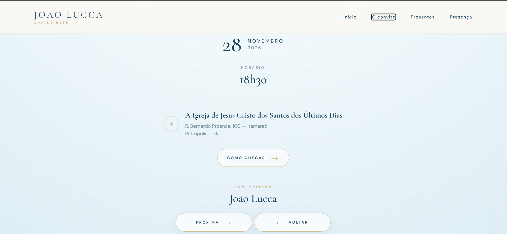
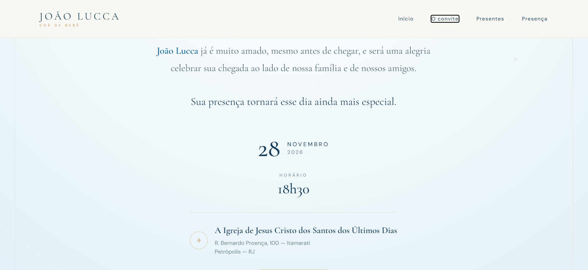
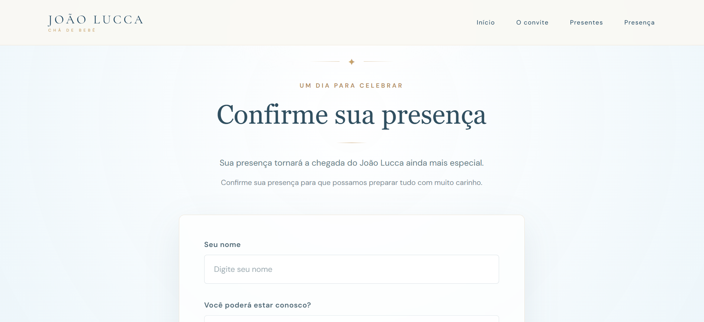
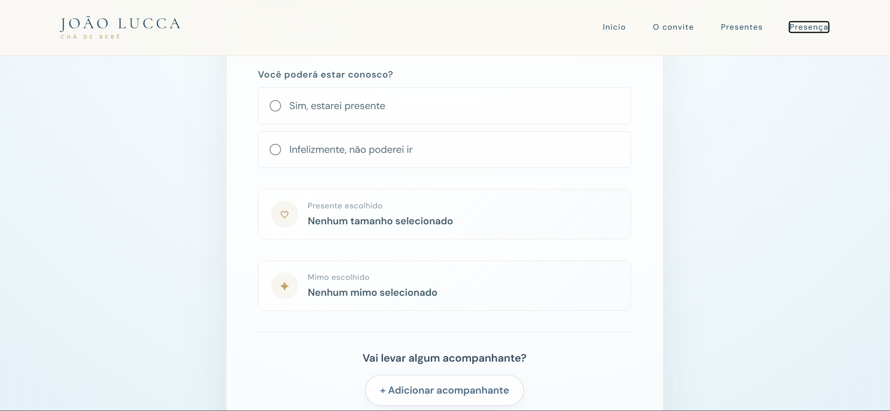
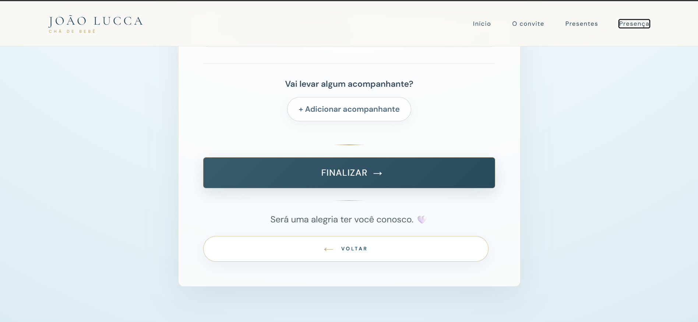
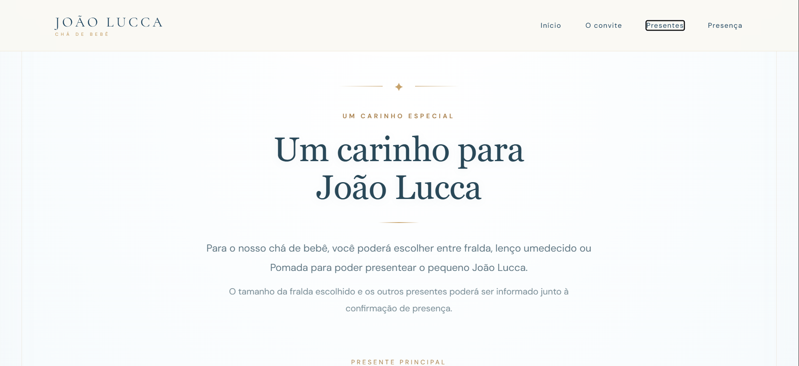
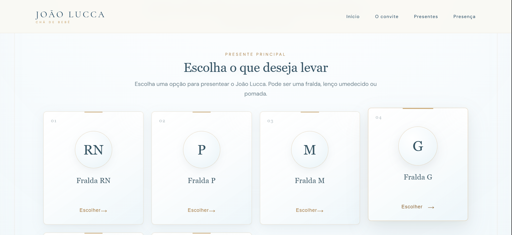
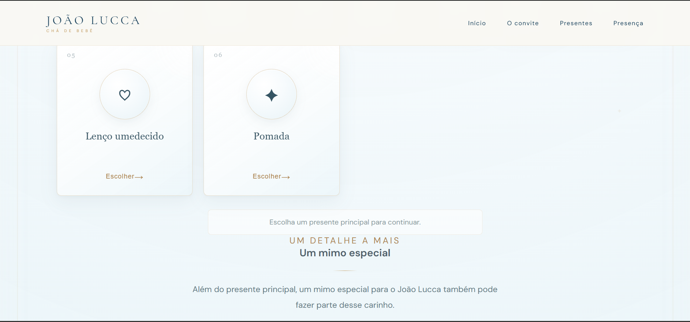
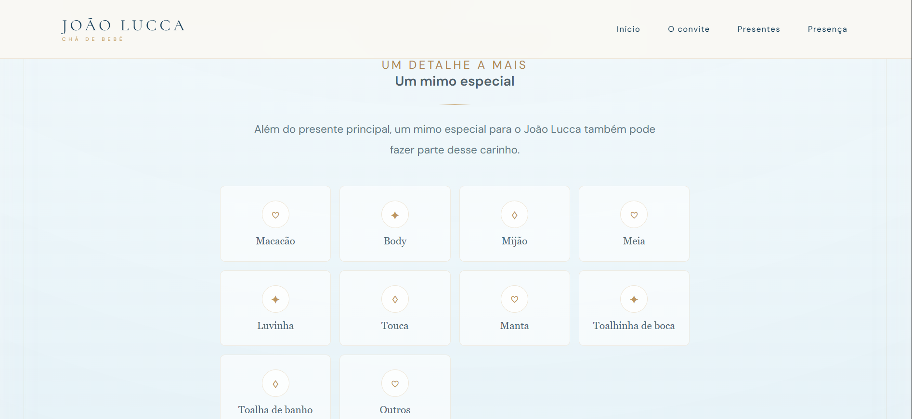
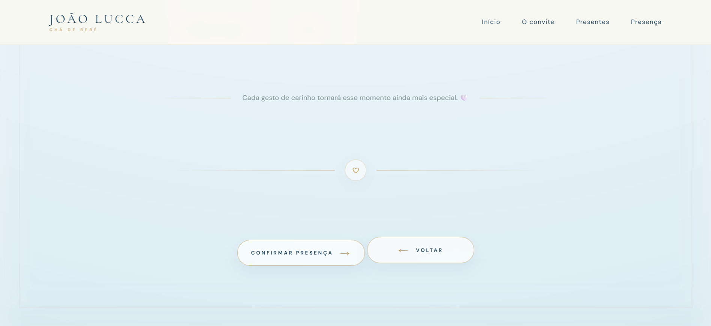

# 🧸 Chá de Bebê João Lucca

Aplicação web desenvolvida com Django para gerenciar convites e confirmações de presença em um chá de bebê.

O projeto foi criado para oferecer aos convidados uma experiência prática e organizada, permitindo confirmar a presença, informar acompanhantes e escolher presentes conforme a disponibilidade.

## 💻 Tecnologias utilizadas

- Python
- Django
- PostgreSQL
- HTML5
- CSS3
- JavaScript

## ✨ Funcionalidades

- Convite digital responsivo
- Confirmação de presença (RSVP)
- Cadastro de acompanhantes adultos e crianças
- Escolha de presentes e mimos
- Controle de disponibilidade dos presentes
- Validação dos dados enviados
- Painel administrativo do Django
- Proteção contra confirmações duplicadas ao atualizar a página
- Controle de concorrência nas confirmações com PostgreSQL

## 📌 Sobre o projeto

Projeto desenvolvido para aplicar conhecimentos de desenvolvimento web full stack, integração com banco de dados e construção de funcionalidades para uma necessidade real.

## 📸 Capturas de tela

### Convite digital

### Confirmação de presença

### Escolha dos presentes

